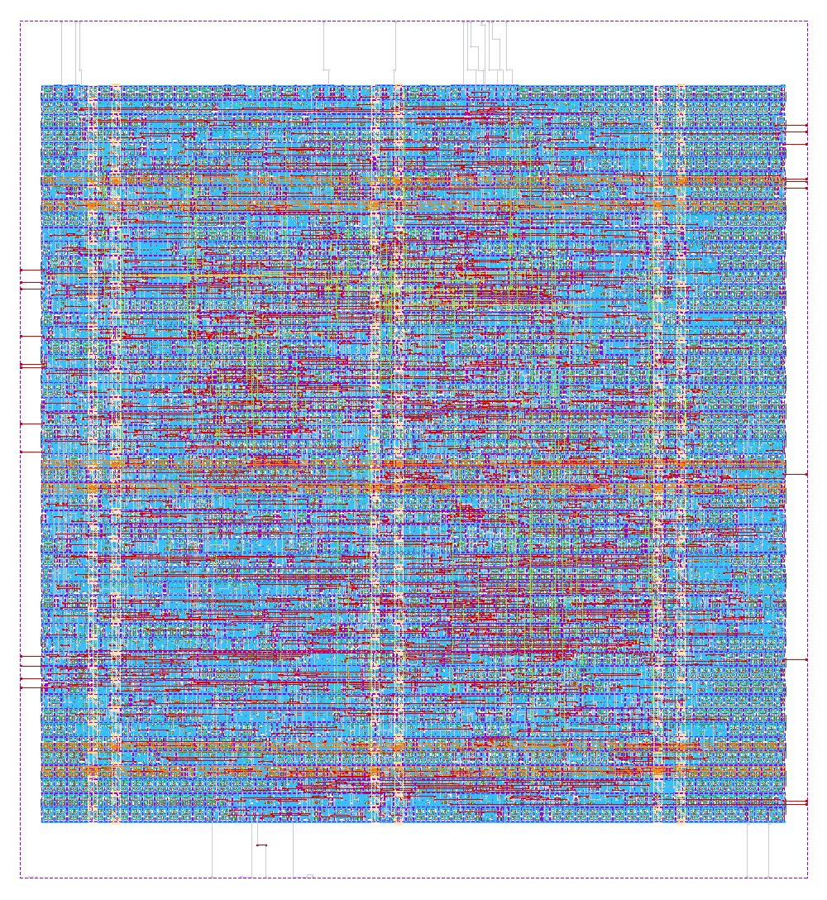

## Final RTL-to-GDSII Results

TinyNoC was successfully implemented through the complete RTL-to-GDSII physical design flow using the IHP SG13G2 130 nm Open PDK.

### Final Results

| Parameter | Result |
|---|---|
| Top Module | `tinynoc_wrapper` |
| Technology | IHP SG13G2 130 nm |
| Synthesized Standard Cells | 928 |
| Synthesized Cell Area | 15,814.6506 µm² |
| Final Die Area | 48,198.1 µm² |
| Final Standard-Cell Utilization | 55.42% |
| Final Routing DRC Errors | 0 |
| Magic DRC Errors | 0 |
| KLayout DRC Errors | 0 |
| LVS Errors | 0 |
| Antenna Violations | 0 |
| Final GDSII | Generated successfully |

### Physical Design Flow

The following stages were completed:

RTL Verification → Logic Synthesis → Floorplanning → Placement → Clock Tree Synthesis → Routing → DRC → LVS → Antenna Check → GDSII

The final GDSII layout is available at:

`physical_design/final_results/tinynoc_wrapper.gds`

### Final Layout

> Note: The current physical-design run used LibreLane's generic fallback SDC. A project-specific timing constraint should be used before quoting a final maximum operating frequency.

## Implementation Evidence

### 1. RTL Verification

The integrated TinyNoC RTL simulation successfully verified basic routing and QoS-based contention handling.

### 2. IHP SG13G2 Synthesis

The final `tinynoc_wrapper` was technology-mapped using the IHP SG13G2 130 nm standard-cell library.

**Final synthesized standard cells: 928**

### 3. Physical Design Metrics

The final physical implementation achieved a die area of **48,198.1 µm²** with approximately **55.42% standard-cell utilization**.

### 4. Physical Verification

Final physical verification completed successfully with:

- Routing DRC errors: **0**
- Magic DRC errors: **0**
- KLayout DRC errors: **0**
- LVS errors: **0**
- Antenna violations: **0**

### 5. Final GDSII

The RTL-to-GDSII implementation flow successfully generated the final `tinynoc_wrapper.gds` layout database.

### 6. Final TinyNoC Layout

Final placed-and-routed TinyNoC layout implemented using the IHP SG13G2 130 nm Open PDK.

